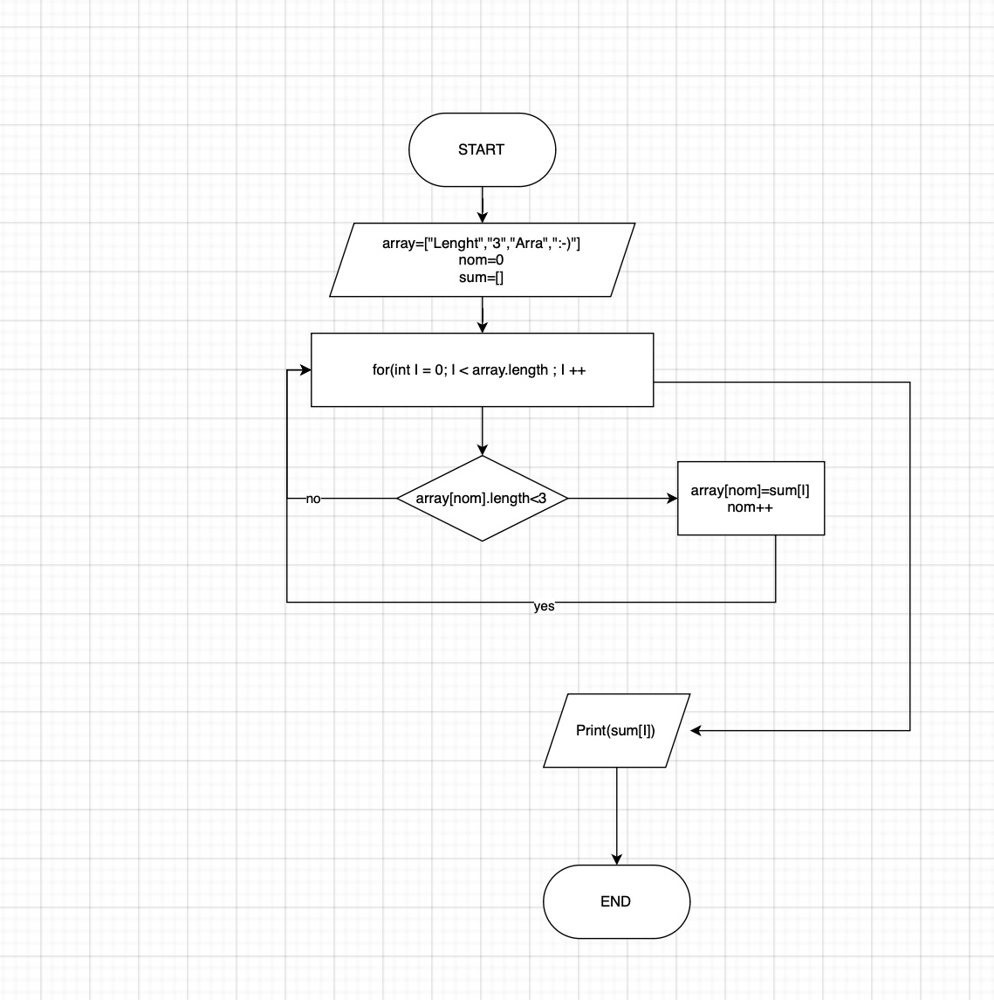

Hello from Kurilov

## Итоговая проверочная работа.

Данная работа необходима для проверки ваших знаний и навыков по итогу прохождения первого блока обучения
на программе разработчик. Мы должны убедиться что базовое знакомство с і прошло успешно.
Задача алгоритмически не самая сложная, однако для полценного выполнения проверочной работы необходимо:
1. Создать репозиторий на GitHub 
2. Нарисовать блок-схему алгоритма (можно обойтись блок-схемой основной содержательной части, если вы
выделяете ее в отдельный метод)
3. Снабдить репозиторий оформленным текстовым описанием решения (файл README. md)
4. Написать программу, решающую поставленную задачу 5. Использовать контроль версий в работе над этим небольшим проектом (не должно быть так что все залитс
одним коммитом, как минимум этапы 2, 3 и 4 должны быть расположены в разных коммитах) Задача: Написать программу, которая из имеющегося массива строк формирует массив из строк, длина которых меньше либо равна 3 символа. Первоначальный массив можно ввести с клавиатуры, либо задать на старте выполнения алгоритма. При решении не рекомендуется пользоваться коллекциями, лучше обойтись
исключительно массивами.

## Пункт 2. (Блок-схема):

# Пункт 3 . (Описательная часть):

 1. Перед написанием основной функции , для решения данной задачи  обьявляется два массива. 
Первый - заполненный изначальными значениями.
Второй - пустой, для последующего заполнения значениями < 3
 2. Далее идет функция которая с помощью оператора __for__ проверяет каждый элемент меньше или равен он 3 и просит полученные значения занести в пустой массив
Так же в данной функции используется новая переменная **count**, которая служит для заполнения пустого мустого массива с последующим увеличение на 1. 
*В нашем случае __count__ - индекс пустого массива!* 
